# EXNO2DS
# AIM:
      To perform Exploratory Data Analysis on the given data set.
      
# EXPLANATION:
  The primary aim with exploratory analysis is to examine the data for distribution, outliers and anomalies to direct specific testing of your hypothesis.
  
# ALGORITHM:
STEP 1: Import the required packages to perform Data Cleansing,Removing Outliers and Exploratory Data Analysis.

STEP 2: Replace the null value using any one of the method from mode,median and mean based on the dataset available.

STEP 3: Use boxplot method to analyze the outliers of the given dataset.

STEP 4: Remove the outliers using Inter Quantile Range method.

STEP 5: Use Countplot method to analyze in a graphical method for categorical data.

STEP 6: Use displot method to represent the univariate distribution of data.

STEP 7: Use cross tabulation method to quantitatively analyze the relationship between multiple variables.

STEP 8: Use heatmap method of representation to show relationships between two variables, one plotted on each axis.

## CODING AND OUTPUT
```
# STEP 1 - Importing Libraries and Loading Dataset

import pandas as pd
import numpy as np
import seaborn as sns
import matplotlib.pyplot as plt

data = pd.read_csv("C:/Users/acer/Downloads/titanic_dataset.csv")

print("\nDataset Loaded Successfully\n")
print(data.head())
print("\nDataset Info:\n")
print(data.info())
print(data.describe())
# STEP 2 - Handling Missing Values

for column in data.columns:
    if data[column].dtype == 'object':
        data[column] = data[column].fillna(data[column].mode()[0])   # Mode for categorical
    else:
        data[column] = pd.to_numeric(data[column], errors='coerce')
        data[column] = data[column].fillna(data[column].median())   # Median for numerical
# STEP 3 - Outlier Detection
plt.figure(figsize=(6,4))
sns.boxplot(x=data["Age"])
plt.title("Boxplot - Age")
plt.show()

plt.figure(figsize=(6,4))
sns.boxplot(x=data["Fare"])
plt.title("Boxplot - Fare")
plt.show()
# STEP 4 - Outlier Removal using IQR Method
def remove_outliers_iqr(df, column):
    Q1 = df[column].quantile(0.25)
    Q3 = df[column].quantile(0.75)
    IQR = Q3 - Q1
    lower = Q1 - 1.5 * IQR
    upper = Q3 + 1.5 * IQR
    return df[(df[column] >= lower) & (df[column] <= upper)]

print("Outliers for Age:", remove_outliers_iqr(data, "Age").shape)
print("Outliers for Fare:", remove_outliers_iqr(data, "Fare").shape)
print("Outliers removed using IQR method.\n")
# STEP 5 - Data Visualization Using Countplots
plt.figure(figsize=(6,4))
sns.countplot(x="Survived", data=data)
plt.title("Countplot - Survival Distribution")
plt.show()
plt.figure(figsize=(6,4))
sns.countplot(x="SibSp", data=data)
plt.title("Countplot - Sibling/Spouse Distribution")
plt.show()
plt.figure(figsize=(6,4))
sns.countplot(x="Pclass", data=data)
plt.title("Countplot - Passenger Class Distribution")
plt.show()
#STEP 6 - Data Visualization Using Displots
sns.displot(data["Age"], kde=True, height=4, aspect=1.5)
plt.title("Displot - Age Distribution")
plt.show()
sns.displot(data["Fare"], kde=True, height=4, aspect=1.5)
plt.title("Displot - Fare Distribution")
plt.show()
# STEP 7 - Cross Tabulation
print("\nCross Tabulation: SibSp vs Survived\n")
print(pd.crosstab(data["SibSp"], data["Survived"]))
print("\nCross Tabulation: Pclass vs Survived\n")
print(pd.crosstab(data["Pclass"], data["Survived"]))
# STEP 8 - Heatmap of Correlation Analysis
plt.figure(figsize=(8,6))
correlation_matrix = data.select_dtypes(include=np.number).corr()
sns.heatmap(correlation_matrix, annot=True, cmap="coolwarm")
plt.title("Correlation Heatmap - Titanic Dataset")
plt.show()
```

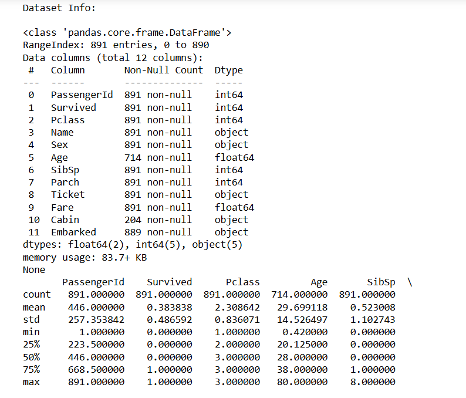
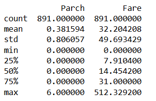
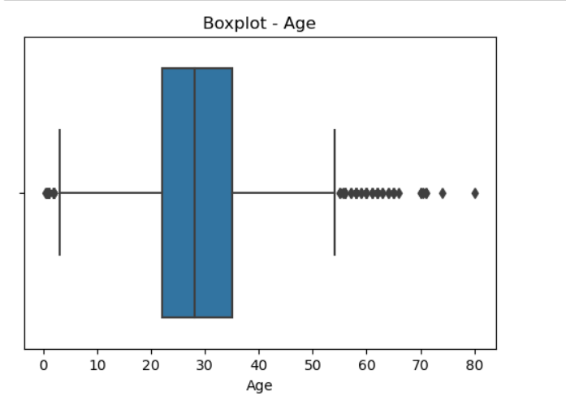
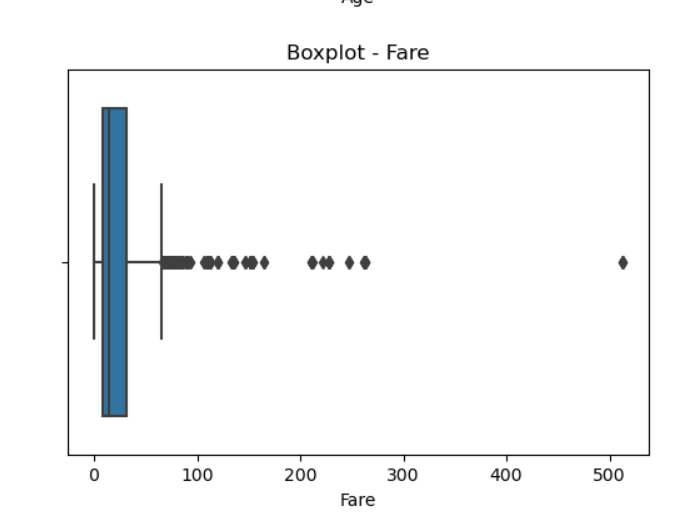
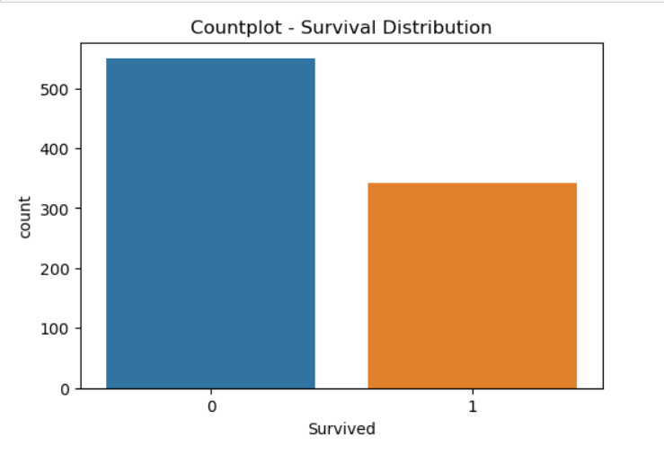
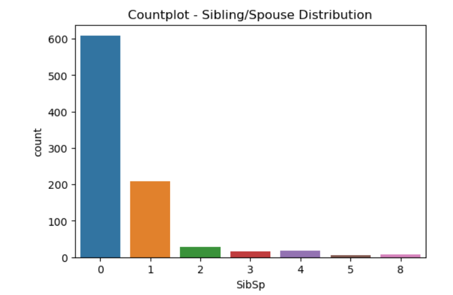
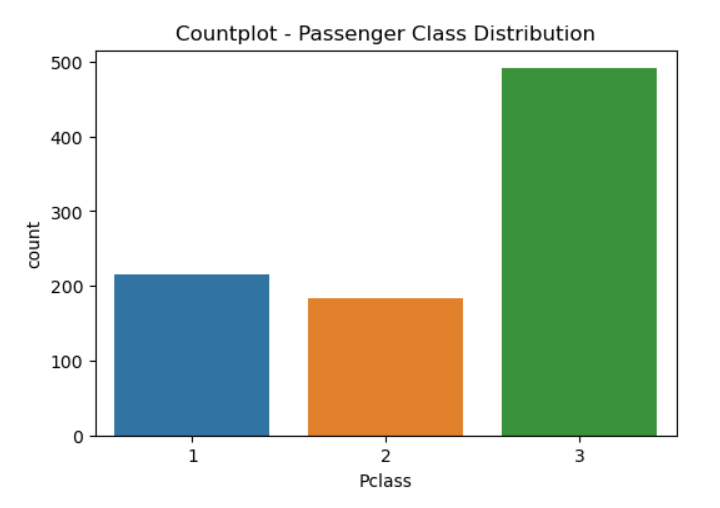
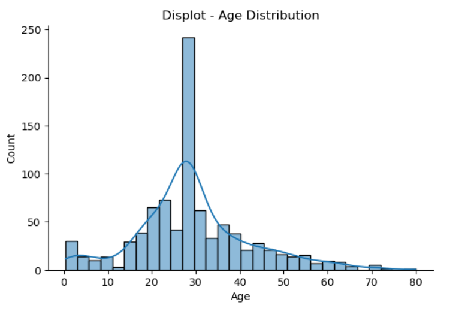
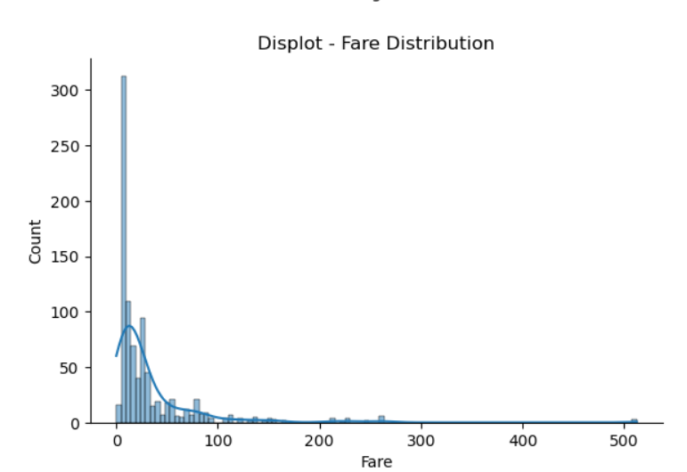
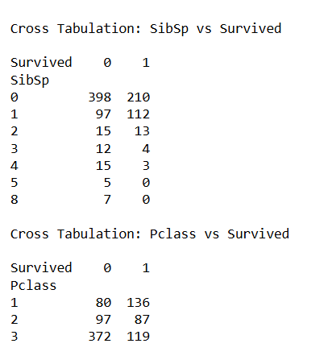
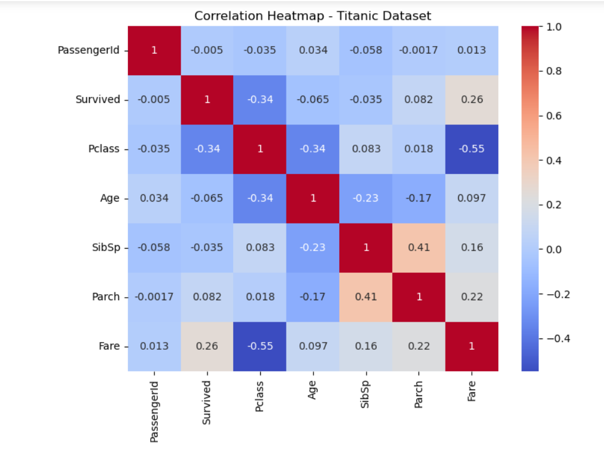

# RESULT
The Program and The Output has been sucessfully Verified along with the Visualization .
